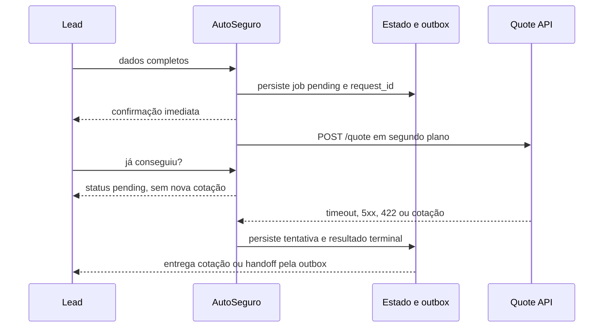

# AutoSeguro

Agente de vendas de seguro auto por uma CLI que simula WhatsApp. Ele coleta os cinco campos obrigatórios, inicia a cotação em segundo plano e mantém a conversa disponível enquanto a API instável trabalha.

A API oficial é a única autoridade de preço e aceitação. O agente não calcula prêmio, franquia, carência ou pró-rata.

## Resultado medido

A avaliação registrada usou 100 conversas válidas, concorrência 10 e a API oficial com `QUOTE_FAILURE_RATE=0.20`, `QUOTE_SLOW_RATE=0.10`, `QUOTE_SLOW_SECONDS=8` e `QUOTE_SEED=42`.

| Métrica | Resultado |
|---|---:|
| Conversas | 100 |
| Chamadas `POST /quote` | 148 |
| Respostas `2xx` | 95 |
| Respostas `500` / `502` / `503` | 14 / 11 / 6 |
| Timeouts | 22 |
| Sucesso na 1ª / 2ª / 3ª tentativa | 63 / 26 / 6 |
| Handoffs após esgotamento | 5 |
| Acknowledgement p50 / p95 / máximo | 1 / 8 / 12 ms |
| Respostas de status enquanto pending | 100 de 100 |
| Operações duplicadas | 0 |
| Preços antes da confirmação da API | 0 |
| Handoffs sem contexto | 0 |
| Transições inválidas | 0 |
| Extrações com Ollama Cloud | 20 de 20 |

O relatório completo, o resultado máquina-legível das 100 conversas e três transcrições representativas estão em [`examples/evaluation/`](examples/evaluation/). A conversa real com LLM e uma chamada lenta da API está em [`examples/conversation-real.md`](examples/conversation-real.md).

## Fluxo assíncrono



Uma mensagem com todos os dados retorna antes de `POST /quote`. O resultado chega depois como uma nova mensagem. A outbox fica no mesmo arquivo durável da conversa e só recebe `delivered_at` depois que o canal aceita a entrega.

Enquanto a cotação está pendente:

- pedido de status recebe o protocolo atual;
- pergunta sobre plano, cobertura ou espera recebe uma resposta honesta, sem antecipar preço;
- mensagem duplicada devolve a resposta original e não abre outro job;
- correção de dado cancela o cliente antigo, marca o job como `failed` por supersessão e cria outro `quote_request_id`;
- pedido de pessoa cancela o cliente, persiste o handoff e prevalece sobre qualquer resposta tardia.

## Política de falha

| Situação em `POST /quote` | Ação |
|---|---|
| Sucesso `2xx` com contrato válido | Grava `delivered` e enfileira a resposta com os valores da API |
| Timeout | Repete, até três tentativas no total |
| `500`, `502` ou `503` | Repete, até três tentativas no total |
| `400` | Não repete; grava `failed` e cria handoff por payload rejeitado |
| `422` | Não repete; informa a recusa sem preço e cria handoff comercial |
| Outro `4xx`, erro de rede ou `2xx` malformado | Não repete; grava `failed` e cria handoff |
| Falhas esgotadas | Informa que não houve cotação, não estima preço e cria handoff |

O timeout padrão é 3 segundos, abaixo dos 8 segundos da lentidão simulada. O intervalo usa backoff exponencial de 200 ms e jitter de até 99 ms. `QUOTE_TIMEOUT_MS` deve ser menor que 8.000 e `QUOTE_MAX_ATTEMPTS` aceita de uma a três tentativas.

A API faz um único sorteio por chamada. `roll < 0.20` produz `500`, `502` ou `503`; `0.20 <= roll < 0.30` dorme 8 segundos. Os ramos são mutuamente exclusivos e as taxas valem por chamada, não por conversa. Para 100 conversas e até três tentativas, a expectativa é 139 chamadas, 27,8 respostas 5xx, 13,9 timeouts, 97,3 resoluções e 2,7 handoffs esgotados. Os números observados acima vieram da execução com seed 42; não foram ajustados à expectativa.

Cada retry preserva o `quote_request_id`, também enviado como `X-Request-ID`. O serviço oficial não declara idempotência. Após reinício, um job `pending` ou `retrying` retoma com a mesma correlação e com o orçamento de tentativas persistido. Se o processo morrer depois de enviar a requisição e antes de gravar sua tentativa, a API pode receber uma chamada adicional. Como cotar é uma leitura, esse risco é aceito aqui; não há promessa de execução exatamente uma vez.

## Como executar

### Requisitos

- Node.js 22.18 ou mais recente
- npm
- Docker, ou Python 3.10+ com `uv`
- chave do Ollama Cloud, ou outro endpoint OpenAI-compatible

### 1. Suba a API oficial

O serviço não foi copiado para este repositório. Assim não existe uma segunda implementação das regras de preço. Use o repositório oficial:

<https://github.com/namastexlabs/namastex-fde-challenge>

Com Docker:

```bash
git clone https://github.com/namastexlabs/namastex-fde-challenge.git
cd namastex-fde-challenge
docker compose up --build
```

Sem Docker, com a instabilidade e a seed da avaliação:

```bash
cd namastex-fde-challenge/quote-service
QUOTE_FAILURE_RATE=0.20 \
QUOTE_SLOW_RATE=0.10 \
QUOTE_SLOW_SECONDS=8 \
QUOTE_SEED=42 \
uv run uvicorn app.main:app --host 127.0.0.1 --port 8000
```

Confirme o serviço:

```bash
curl http://127.0.0.1:8000/health
curl http://127.0.0.1:8000/planos
```

### 2. Configure o agente

```bash
npm install
cp .env.example .env
```

Preencha `.env` sem commitá-lo:

```dotenv
LLM_BASE_URL=https://ollama.com/v1
LLM_API_KEY=sua-chave-do-Ollama-Cloud
LLM_MODEL=deepseek-v4-flash:0731
LLM_TIMEOUT_MS=30000
QUOTE_API_URL=http://127.0.0.1:8000
```

O exemplo usa o endpoint OpenAI-compatible do [Ollama Cloud](https://docs.ollama.com/api/openai-compatibility). As variáveis `LLM_*` aceitam outro provedor compatível.

### 3. Converse pela CLI

```bash
npm run chat -- --conversation avaliacao
```

Digite `sair` para encerrar. O mesmo `conversation_id` retoma estado, job pendente e outbox.

Para repetir o roteiro sem dados pessoais:

```bash
npm run chat -- \
  --conversation demo-real \
  --replay examples/conversation-input.jsonl \
  --reset
```

O replay aceita JSONL com `message_id`, `message_type` e `text`. Também aceita `conversation_id`, `message_index`, `sender_role` e `message_body` do dataset oficial; linhas do vendedor são ignoradas.

Estado e auditoria ficam em:

```text
.runtime/conversations/<conversation_id>.json
.runtime/audit.jsonl
```

Use `STATE_DIR` e `AUDIT_LOG_PATH` para trocar os caminhos.

## Avaliação reproduzível

Reinicie a API oficial com seed 42 antes do comando. A avaliação executa os cenários forçados, 100 conversas contra a API real e 20 exemplos de linguagem no Ollama Cloud:

```bash
npm run evaluate -- --conversations 100
```

Ela usa concorrência 10 para a API e 2 para o LLM. O resultado padrão fica em `.runtime/evaluation-result.json` e `.runtime/evaluation-result.md`. Para atualizar os artefatos versionados:

```bash
npm run evaluate -- \
  --conversations 100 \
  --concurrency 10 \
  --language-conversations 20 \
  --language-concurrency 2 \
  --output examples/evaluation/reliability-100.json
```

O passe primário usa extração determinística para isolar a instabilidade da API. Cada conversa manda os dados, repete a mensagem e pergunta “Já conseguiu?” antes de aguardar o resultado. O passe separado usa 20 formas de expressão em pt-BR, inspiradas no dataset sintético, e classifica falha de transporte do LLM separada de erro de extração.

## Testes e validação

```bash
npm test
npm run typecheck
npm run lint
npm run check
```

A suíte determinística cobre:

- cotação imediata em background e outbox durável;
- cotação feliz, CEP de alto risco e pró-rata;
- idade acima de 75 e veículo com mais de 20 anos;
- timeout seguido de sucesso;
- 5xx seguido de sucesso;
- 500 + timeout + sucesso;
- 500/502/503 até handoff;
- 400 e 422 sem retry;
- duplicata, status e informação durante `pending`;
- correção enquanto `pending` e descarte do resultado antigo;
- handoff humano antes de uma resposta tardia;
- retomada de coleta e retomada de job após reinício;
- mídia sem transcrição;
- validação antes da API;
- ausência de CPF, telefone, e-mail e CEP completo na auditoria.

## Arquitetura

A aplicação é uma única fatia vertical. Não há servidor web, monorepo, Redis ou fila externa.

```text
src/cli.ts            canal interativo, replay e entrega da outbox
src/agent.ts          estado, jobs em background, deduplicação e handoff
src/validation.ts     validação dos candidatos antes da API
src/quote-client.ts   timeout, retry, cancelamento e contrato da cotação
src/llm.ts            cliente OpenAI-compatible para extração e redação
src/persistence.ts    estado atômico em JSON e auditoria JSONL
src/privacy.ts        remoção de CPF, telefone e e-mail; máscara de CEP
src/evaluate.ts       avaliação real com concorrência limitada
```

**LLM:** extrai candidatos e dá linguagem natural às perguntas de coleta. O núcleo remove CPF, telefone e e-mail antes da chamada. A saída passa por validação em runtime. O LLM classifica intenção; regras determinísticas decidem o efeito.

**Núcleo determinístico:** controla campos, origem, transições, deduplicação, cancelamento, retry, resultado, outbox e handoff.

**API oficial:** decide aceitação e devolve todos os valores monetários. Idade acima de 75 anos e veículo com mais de 20 anos chegam à API; o `422` vira recusa e handoff comercial sem preço.

**Pessoa do time:** recebe indisponibilidade persistente, recusa comercial, mídia sem transcrição, pedido explícito, pedido fora do escopo ou ambiguidade repetida.

## Estado, outbox e auditoria

Cada conversa persiste:

- etapa `collecting`, `quoting`, `resolved` ou `handoff`;
- campos e `message_id` de origem;
- mensagens já processadas e respostas idempotentes;
- jobs com `pending`, `retrying`, `delivered` ou `failed`;
- histórico de transições e tentativas;
- `quote_request_id`, resultado ou motivo do handoff;
- respostas terminais na outbox e `delivered_at`.

A escrita usa arquivo temporário e `rename`. A outbox oferece entrega pelo menos uma vez: uma queda depois de imprimir e antes de gravar `delivered_at` pode repetir a resposta, mas não cria outra cotação.

Há um evento JSON por mensagem e por chamada HTTP. Todo evento possui `conversation_id`, `message_id`, `timestamp`, `stage`, campos com origem, `quote_request_id`, `quote_status`, tentativa, latência, status HTTP, resultado e motivo de handoff.

O corpo bruto da mensagem não entra no estado nem na auditoria. CPF, telefone e e-mail são removidos antes do LLM e antes de gravar qualquer evento. O CEP aparece mascarado na auditoria. O estado contém só os cinco campos necessários, usa permissão `0600` e fica fora do Git.

O dataset sintético oficial serviu apenas para conferir formas de expressão, formatos sensíveis e mídia sem transcrição. Nenhum registro do dataset foi copiado.

## Trade-offs

- O processo mantém um registro de jobs por conversa e usa arquivos locais. Isso basta para a CLI. Múltiplas réplicas exigiriam banco, lock distribuído e outbox transacional.
- Os três IDs de plano do contrato são validados localmente. Uma mudança no catálogo exigirá atualizar a lista ou consultar `GET /planos`.
- Respostas com preço, recusa e handoff são determinísticas. O LLM não pode alterar valor nem decisão.
- Erro de rede genérico não recebe retry, pois a política permite apenas timeout, `500`, `502` e `503`.
- O histórico real de ferramentas de IA será incluído pelo responsável pela submissão em `ai-logs/`; este repositório não inventa esse material.
